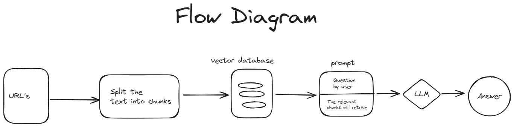

# Information_Retrival_Application

## Problem Statement
In the ever-evolving world, staying informed is crucial for making decisions. However, accessing relevant and up-to-date information can be time-consuming and overwhelming. This Tool aims to address this problem by providing users with an effortless way to retrieve valuable insights from the articles.

## Data Preparation
To ensure accurate and insightful results, the tool leverages a combination of web scraping and API integration to gather information from reputable news websites.

## Approach

### 1. Users Input Article URLs
Users start by providing URLs of articles or any online content they are interested in. These URLs could point to news articles, blog posts, research papers, or any relevant content.

### 2. Data Splitting and Storage
Data Splitting:
The retrieved data from the provided URLs is split into manageable chunks. This is done to optimize storage and processing efficiency. Each chunk represents a portion of the information extracted from the articles.

Vector Database:
The chunks of data are organized and stored in a vector database. A vector database is a type of database optimized for storing and retrieving vectorized data efficiently. In this context, each chunk of data can be represented as a vector, making it suitable for storage in such a database.

### 3. Interactive Queries and LLM Integration
User Prompts:
Users provide prompts or questions related to the content. These prompts could be inquiries about specific topics, trends, events, or any other subject of interest.

### Retrieve Related Chunks:
The system uses the user prompts to retrieve relevant chunks from the vector database. This retrieval is based on the similarity or relevance of the chunks to the user's queries. The goal is to fetch portions of data that are most likely to contain information related to the user's questions.

### Large Language Models (LLM):
Utilizing Large Language Models (LLM), such as GPT-3, the retrieved chunks are processed. The LLM has the ability to understand natural language and generate human-like text. In this context, the LLM is employed to analyze the content of the retrieved chunks and generate detailed answers or summaries in response to the user's queries.

### 4. User Output
User Receives Answers:
Finally, users receive answers to their queries. These answers are generated by the LLM, taking into account the information stored in the relevant data chunks. The responses are designed to be detailed and context-aware, providing users with valuable insights into the content they are interested in based on their input.

### Benefits of the Approach:

* Efficient Data Storage
* Relevance to User Queries
* Context-Aware Answers
* Scalability

## Final Mockup Application

### User Interface:

Input Section:
Users provide article URLs.

Data Splitting and Storage:
The tool automatically splits the data into chunks for efficient processing and storage in the vector database.

User Prompts:
Users input prompts or questions.

Retrieve and Process:
Relevant chunks are retrieved from the vector database based on user prompts.
LLM processes the chunks and generates context-aware answers.

User Output:
Users receive detailed answers or summaries enriched with information from the relevant data chunks.

